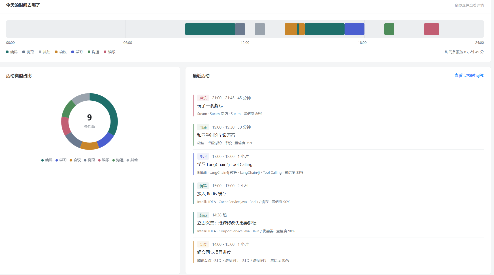
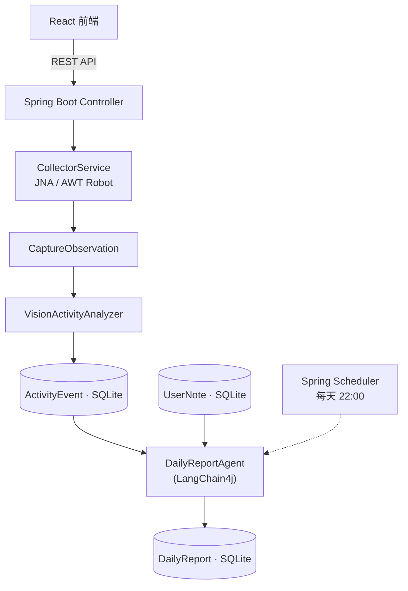

# WhatADay

> 一个运行在 Windows 桌面会话中的**本地优先工作复盘 Agent**。

定时读取前台应用与窗口信息、低频截取屏幕，通过视觉模型把屏幕内容转换成结构化活动事件；每天晚上由 LangChain4j Agent 通过 **Tool Calling** 查询当天活动与手动记录，自动生成并保存每日工作日报；前端可视化时间线、统计与日报。

采集与理解过程以**本地优先**为原则：敏感应用不截图，分析后立即删除原始截图，默认只保存结构化活动。

<p align="center">
  
</p>

> 📷 **待补截图**：把后端 `mvn spring-boot:run` 和前端 `npm run dev` 一起跑起来，
> 访问 http://127.0.0.1:5173 ，截图存到 `docs/images/` 下（建议 `dashboard.png` 工作台、
> `timeline.png` 时间线、`reports.png` 日报 三张），然后删掉这段提示。

---

## 技术栈

| 层 | 技术 |
|---|---|
| 后端 | Java 17 · Spring Boot · LangChain4j · SQLite（JdbcTemplate）· JNA · AWT Robot · Spring Scheduler · Springdoc OpenAPI |
| 前端 | React · TypeScript · Vite · Ant Design · ECharts · Axios |

## 系统架构



两条独立流程：

```text
截图 + 窗口信息 → VisionActivityAnalyzer → ActivityEvent
ActivityEvent + UserNote → DailyReportAgent → DailyReport
```

## 核心亮点

- **LangChain4j Agent Tool Calling 自动生成日报**：Agent 只能通过三个受限工具访问数据（`queryActivityEvents` / `queryUserNotes` / `saveDailyReport`），`report_date` 唯一约束 + upsert 保证重复生成幂等。
- **视觉模型将屏幕内容转为结构化活动事件**：输出映射为固定活动类型枚举 + 描述 + 关键词 + 置信度。
- **隐私与成本控制**：截图前先做敏感应用黑名单过滤；低频采样（每 2 分钟最多一张）；分析后立即删除原始截图；日志不输出敏感信息。
- **失败可降级**：模型调用失败时用窗口信息生成事件（`source = WINDOW_FALLBACK`）。

## 技术栈徽章


## 快速开始

> 环境要求：JDK 17+、Node.js 18+、Maven 3.9+。
> 采集器需运行在 Windows 用户桌面会话中；Mock 模式无此要求。

### 后端

```bash
cd backend
mvn spring-boot:run
# 接口文档：http://127.0.0.1:8080/swagger-ui.html
```

### 前端

```bash
cd frontend
npm install
npm run dev
# 页面：http://127.0.0.1:5173
```

### Mock 模式

无需模型 API Key 即可运行：

```yaml
whataday:
  collector:
    mode: mock
```

启动时会自动灌入当天示例数据（覆盖全部七种活动类型）并生成一份日报，前端一打开就有内容。

### 桌面采集模式（Windows）

要采集真实的前台窗口，把 `mode` 改成 `desktop`：

```yaml
whataday:
  collector:
    mode: desktop
    excluded-processes:      # 命中黑名单的应用：不截图、不调用模型
      - WeChat.exe
      - Alipay.exe
    window-poll-seconds: 30          # 读取前台窗口的间隔
    screenshot-min-interval-seconds: 120   # 两次截图之间的最小间隔
    max-merge-minutes: 30            # 单个活动最多合并到多少分钟
```

采集器每 30 秒读取一次前台窗口；窗口变化时才产生新观察，并按节流规则决定是否截图。
截图会按宽度缩放后落盘，**分析完成后立即删除**，不会在磁盘上留存。

### 接入视觉模型

默认**不启用**视觉模型：没有配置 API Key 时，活动分析会自动退回「仅用窗口信息」的降级模式
（`source = WINDOW_FALLBACK`），应用照常运行。要启用，设置环境变量即可——Key 不写进配置文件：

```powershell
# Windows PowerShell
$env:WHATADAY_VISION_API_KEY  = "sk-..."
# 可选：换用任意 OpenAI 兼容端点（下面以通义千问 VL 为例）
$env:WHATADAY_VISION_BASE_URL = "https://dashscope.aliyuncs.com/compatible-mode/v1"
$env:WHATADAY_VISION_MODEL    = "qwen-vl-plus"
```

然后照常 `mvn spring-boot:run`。模型会把「应用名 + 窗口标题 + 时间 + 截图」理解成
结构化的活动类型、描述、关键词与置信度；任何调用失败都会被捕获并降级，不会中断采集。
若所用端点不支持 `response_format` 参数，把 `whataday.vision.use-json-response-format` 设为 `false`。

### 打包为单个 jar（演示推荐）

前后端一起构建，产出一个可独立运行的 jar，不需要再单独启动前端服务：

```bash
bash scripts/build-all.sh
java -jar backend/target/whataday-*.jar
# 打开 http://127.0.0.1:8080
```

Windows 上等价的手动步骤（在仓库根目录执行）：

```powershell
cd frontend; npm install; npm run build; cd ..
Remove-Item -Recurse -Force backend\src\main\resources\static -ErrorAction SilentlyContinue
New-Item -ItemType Directory -Force backend\src\main\resources\static | Out-Null
Copy-Item -Recurse frontend\dist\* backend\src\main\resources\static\
cd backend; mvn clean package -DskipTests; cd ..
java -jar backend\target\whataday-*.jar
```

打包后前端路由（`/timeline`、`/reports` 等）由后端回退到 `index.html` 处理，
所以在浏览器里直接访问或刷新这些地址都能正常打开。

> 数据库文件默认生成在**工作目录**下的 `data/whataday.db`，启动日志里会打印它的绝对路径。
> 目录不存在时会自动创建，所以从任何位置启动都能正常运行——不要求必须在 `backend` 目录里启动。

## 开发进度

| 里程碑 | 内容 | 状态 |
|---|---|---|
| M0 | 仓库初始化 + 前后端骨架 + 工程规范 | ✅ 已完成 |
| M1 | SQLite 表结构 + JdbcTemplate Repository | ✅ 已完成 |
| M2 | Mock 数据 + REST API + Swagger | ✅ 已完成 |
| M3 | 前端四页（工作台/时间线/日报/记录） | ✅ 已完成 |
| M4 | JNA 前台窗口 + Robot 截图 | ✅ 已完成 |
| M5 | 视觉模型接入 + 失败降级 | ✅ 已完成 |
| M6 | Agent 日报 + Scheduler + 收尾 | ✅ 已完成 |

详见 [DEV_ROADMAP.md](DEV_ROADMAP.md)。

## 文档

- [PROJECT_PLAN.md](PROJECT_PLAN.md) —— 功能与技术方案（做什么）
- [DEV_ROADMAP.md](DEV_ROADMAP.md) —— 推进节奏与 GitHub 维护计划（怎么分次做）

## License

[MIT](LICENSE)
