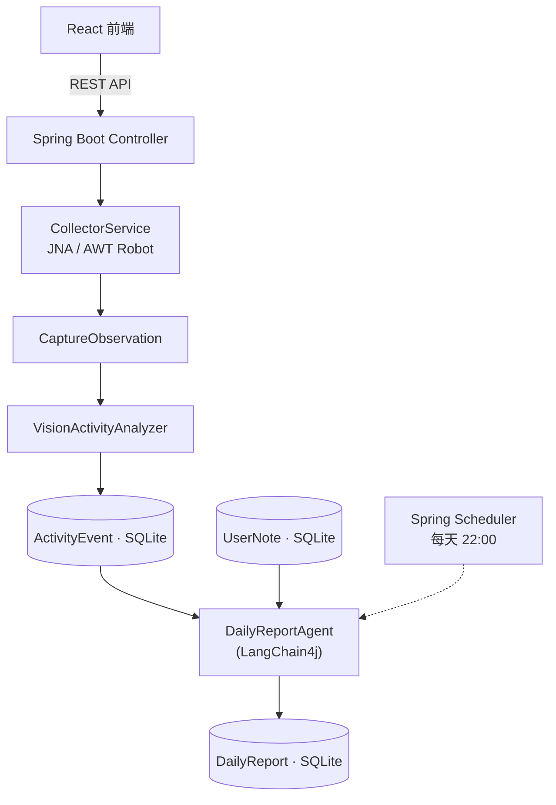

# WhatADay

> 一个运行在 Windows 桌面会话中的**本地优先工作复盘 Agent**。

定时读取前台应用与窗口信息、低频截取屏幕，通过视觉模型把屏幕内容转换成结构化活动事件；每天晚上由 LangChain4j Agent 通过 **Tool Calling** 查询当天活动与手动记录，自动生成并保存每日工作日报；前端可视化时间线、统计与日报。

采集与理解过程以**本地优先**为原则：敏感应用不截图，分析后立即删除原始截图，默认只保存结构化活动。

<p align="center">
  
</p>

> 📷 效果图占位，将在前端完成后补上（见 Roadmap M3）。

---

## 技术栈

| 层 | 技术 |
|---|---|
| 后端 | Java 17 · Spring Boot · LangChain4j · SQLite（JdbcTemplate）· JNA · AWT Robot · Spring Scheduler · Springdoc OpenAPI |
| 前端 | React · TypeScript · Vite · Ant Design · ECharts · Axios |

## 系统架构



两条独立流程：

```text
截图 + 窗口信息 → VisionActivityAnalyzer → ActivityEvent
ActivityEvent + UserNote → DailyReportAgent → DailyReport
```

## 核心亮点

- **LangChain4j Agent Tool Calling 自动生成日报**：Agent 只能通过三个受限工具访问数据（`queryActivityEvents` / `queryUserNotes` / `saveDailyReport`），`report_date` 唯一约束 + upsert 保证重复生成幂等。
- **视觉模型将屏幕内容转为结构化活动事件**：输出映射为固定活动类型枚举 + 描述 + 关键词 + 置信度。
- **隐私与成本控制**：截图前先做敏感应用黑名单过滤；低频采样（每 2 分钟最多一张）；分析后立即删除原始截图；日志不输出敏感信息。
- **失败可降级**：模型调用失败时用窗口信息生成事件（`source = WINDOW_FALLBACK`）。

## 技术栈徽章


## 快速开始

> 环境要求：JDK 17+、Node.js 18+、Maven 3.9+。
> 采集器需运行在 Windows 用户桌面会话中；Mock 模式无此要求。

### 后端

```bash
cd backend
mvn spring-boot:run
# 接口文档：http://127.0.0.1:8080/swagger-ui.html
```

### 前端

```bash
cd frontend
npm install
npm run dev
# 页面：http://127.0.0.1:5173
```

### Mock 模式

无需模型 API Key 即可运行：

```yaml
whataday:
  collector:
    mode: mock
```

## 开发进度

| 里程碑 | 内容 | 状态 |
|---|---|---|
| M0 | 仓库初始化 + 前后端骨架 + 工程规范 | ✅ 已完成 |
| M1 | SQLite 表结构 + JdbcTemplate Repository | ✅ 已完成 |
| M2 | Mock 数据 + REST API + Swagger | ⬜ 待开始 |
| M3 | 前端四页（工作台/时间线/日报/记录） | ⬜ 待开始 |
| M4 | JNA 前台窗口 + Robot 截图 | ⬜ 待开始 |
| M5 | 视觉模型接入 + 失败降级 | ⬜ 待开始 |
| M6 | Agent 日报 + Scheduler + 收尾 | ⬜ 待开始 |

详见 [DEV_ROADMAP.md](DEV_ROADMAP.md)。

## 文档

- [PROJECT_PLAN.md](PROJECT_PLAN.md) —— 功能与技术方案（做什么）
- [DEV_ROADMAP.md](DEV_ROADMAP.md) —— 推进节奏与 GitHub 维护计划（怎么分次做）

## License

[MIT](LICENSE)
