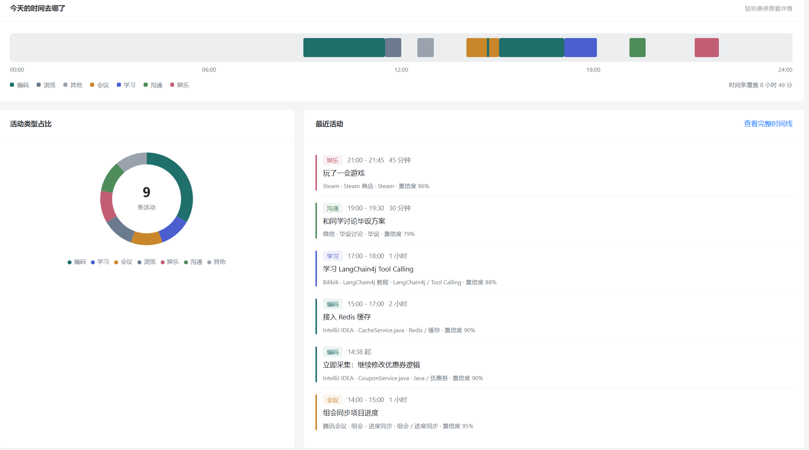
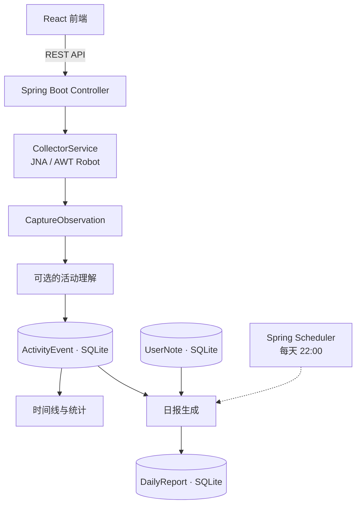
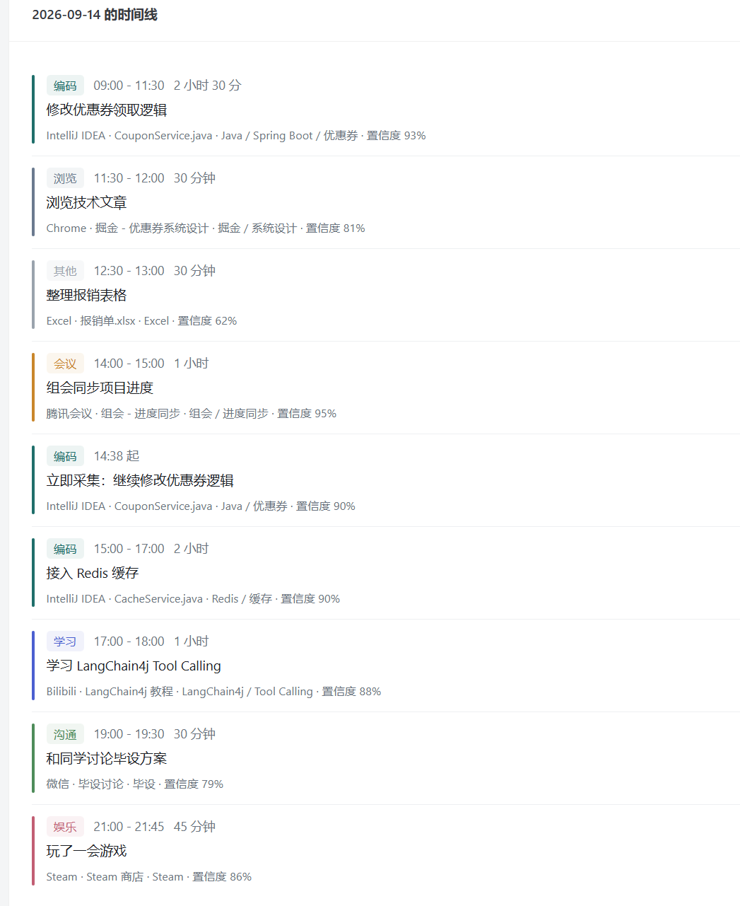
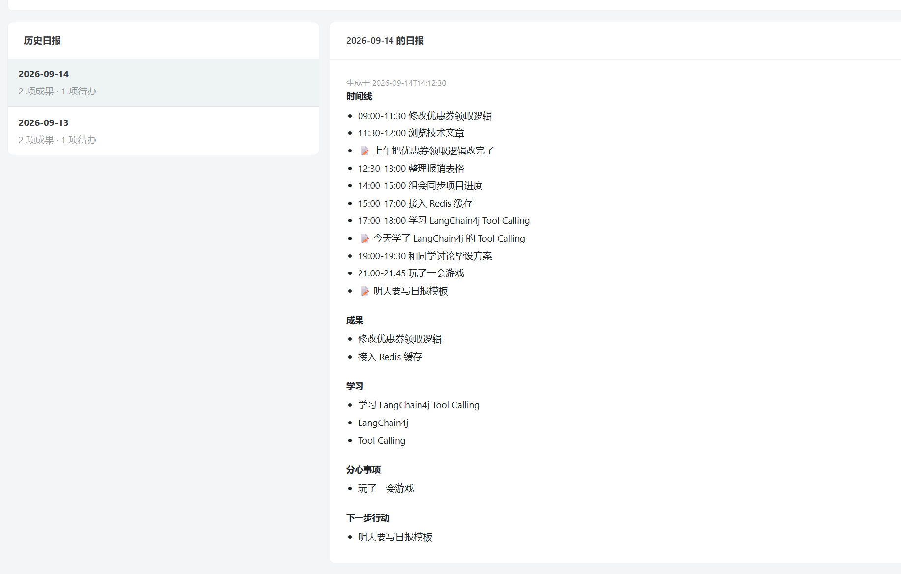

# WhatADay

> 一个本地优先的个人工作记录与复盘工具。

WhatADay 自动记录你在电脑上的工作活动，将零散的窗口变化整理成结构化时间线，并生成每日工作复盘。它帮助你回顾当天完成了什么、时间花在哪里，以及接下来应该继续处理什么。

视觉理解和文本生成是可选增强能力。没有配置模型时，基础采集、统计和规则日报仍然可以运行。

采集与理解过程以**本地优先**为原则：敏感应用不截图，分析后立即删除原始截图，默认只保存结构化活动。

<p align="center">
  
</p>

---

## 功能

- 自动记录前台应用和窗口活动
- 将活动整理成连续的工作时间线
- 支持手动记录计划、问题和下一步
- 根据当天活动生成工作日报
- 统计工作时长和活动类型
- 通过可选的视觉模型理解屏幕内容
- 在模型不可用时退化为窗口信息分析

## 工作方式

```text
桌面活动
   ↓
窗口观察与隐私过滤
   ↓
结构化活动事件
   ↓
时间线、统计与日报
```

## 技术栈

| 层 | 技术 |
|---|---|
| 后端 | Java 17 · Spring Boot · SQLite（JdbcTemplate）· JNA · AWT Robot · Spring Scheduler · Springdoc OpenAPI |
| AI 能力 | LangChain4j · OpenAI 兼容模型 |
| 前端 | React · TypeScript · Vite · Ant Design · ECharts · Axios |

## 系统架构


```mermaid
flowchart TD
    FE["React 前端"] -->|REST API| CT["Spring Boot Controller"]
    CT --> CS["CollectorService<br/>JNA / AWT Robot"]
    CS --> CO["CaptureObservation"]
    CO --> VA["可选的活动理解"]
    VA --> AE[("ActivityEvent · SQLite")]
    AE --> TL["时间线与统计"]
    AE --> DRA["日报生成"]
    UN[("UserNote · SQLite")] --> DRA
    DRA --> DR[("DailyReport · SQLite")]
    SCH["Spring Scheduler<br/>每天 22:00"] -.-> DRA
```

两条独立流程：

```text
截图 + 窗口信息 → 活动理解 → ActivityEvent
ActivityEvent + UserNote → 日报生成 → DailyReport
```

## 隐私设计

- 敏感应用在截图前过滤，命中后不截图、不调用模型
- 截图分析完成后立即删除，异常路径同样清理
- 默认只保存结构化活动，不保存屏幕原图
- 低频采样，减少不必要的截图和模型调用
- API Key 通过环境变量配置，不写入仓库

## 关键实现

- 活动事件使用固定类型、描述、关键词和置信度保存，便于后续统计与检索。
- 日报生成通过受限的数据访问工具完成，不能直接访问数据库或文件系统。
- 日报按日期唯一保存，重复生成只更新同一天的记录。
- 模型调用失败时退化为窗口信息分析，外部服务不可用不会阻断本地记录。

## 界面

<p align="center">
  
  
</p>

## 技术栈徽章


## 快速开始

> 环境要求：JDK 17+、Node.js 18+。
> 项目自带 **Maven Wrapper**，**不需要单独安装 Maven**——Windows 用 `mvnw.cmd`，macOS / Linux 用 `./mvnw`，
> 下文出现的 `mvn` 命令都可以替换成它们（首次运行会自动下载 Maven）。
> 采集器需运行在 Windows 用户桌面会话中；Mock 模式无此要求。

### 后端

```bash
cd backend
mvn spring-boot:run
# 接口文档：http://127.0.0.1:8080/swagger-ui.html
```

### 前端

```bash
cd frontend
npm install
npm run dev
# 页面：http://localhost:5173
```

### Mock 模式

无需模型 API Key 即可运行：

```yaml
whataday:
  collector:
    mode: mock
```

启动时会自动灌入当天示例数据（覆盖全部七种活动类型）并生成一份日报，前端一打开就有内容。

### 桌面采集模式（Windows）

要采集真实的前台窗口，把 `mode` 改成 `desktop`：

```yaml
whataday:
  collector:
    mode: desktop
    excluded-processes:      # 命中黑名单的应用：不截图、不调用模型
      - WeChat.exe
      - Alipay.exe
    window-poll-seconds: 30          # 读取前台窗口的间隔
    screenshot-min-interval-seconds: 120   # 两次截图之间的最小间隔
    max-merge-minutes: 30            # 单个活动最多合并到多少分钟
```

采集器每 30 秒读取一次前台窗口；窗口变化时才产生新观察，并按节流规则决定是否截图。
截图会按宽度缩放后落盘，**分析完成后立即删除**，不会在磁盘上留存。

### 接入视觉模型

默认**不启用**视觉模型：没有配置 API Key 时，活动分析会自动退回「仅用窗口信息」的降级模式
（`source = WINDOW_FALLBACK`），应用照常运行。要启用，设置环境变量即可——Key 不写进配置文件：

```powershell
# Windows PowerShell
$env:WHATADAY_VISION_API_KEY  = "sk-..."
# 可选：换用任意 OpenAI 兼容端点（下面以通义千问 VL 为例）
$env:WHATADAY_VISION_BASE_URL = "https://dashscope.aliyuncs.com/compatible-mode/v1"
$env:WHATADAY_VISION_MODEL    = "qwen-vl-plus"
```

然后照常 `mvn spring-boot:run`。模型会把「应用名 + 窗口标题 + 时间 + 截图」理解成
结构化的活动类型、描述、关键词与置信度；任何调用失败都会被捕获并降级，不会中断采集。
若所用端点不支持 `response_format` 参数，把 `whataday.vision.use-json-response-format` 设为 `false`。

### 打包为单个 jar（演示推荐）

前后端一起构建，产出一个可独立运行的 jar，不需要再单独启动前端服务：

```bash
bash scripts/build-all.sh
java -jar backend/target/whataday-*.jar
# 打开 http://127.0.0.1:8080
```

Windows 上等价的手动步骤（在仓库根目录执行）：

```powershell
cd frontend; npm install; npm run build; cd ..
Remove-Item -Recurse -Force backend\src\main\resources\static -ErrorAction SilentlyContinue
New-Item -ItemType Directory -Force backend\src\main\resources\static | Out-Null
Copy-Item -Recurse frontend\dist\* backend\src\main\resources\static\
cd backend; mvn clean package -DskipTests; cd ..
java -jar backend\target\whataday-*.jar
```

打包后前端路由（`/timeline`、`/reports` 等）由后端回退到 `index.html` 处理，
所以在浏览器里直接访问或刷新这些地址都能正常打开。

> 数据库文件默认生成在**工作目录**下的 `data/whataday.db`，启动日志里会打印它的绝对路径。
> 目录不存在时会自动创建，所以从任何位置启动都能正常运行——不要求必须在 `backend` 目录里启动。

## 文档

- [项目设计](PROJECT_PLAN.md)
- [开发说明](DEV_ROADMAP.md)
- [从零读懂 WhatADay](docs/从零读懂WhatADay.md)

## License

[MIT](LICENSE)
